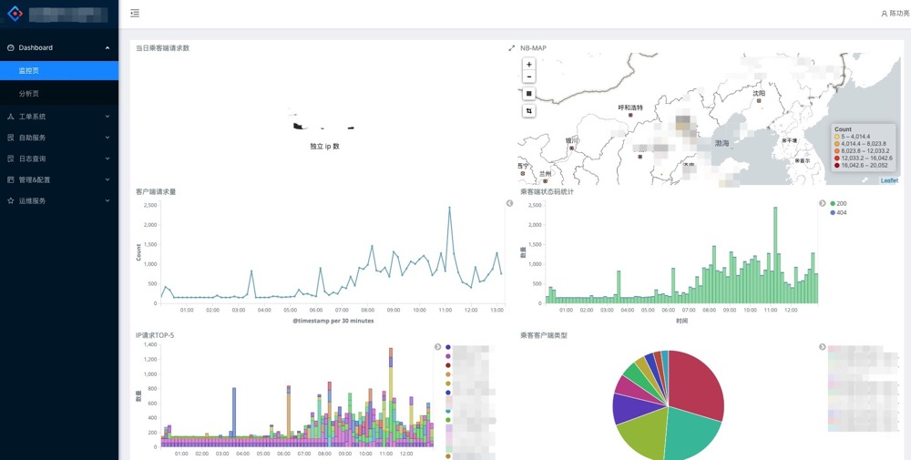
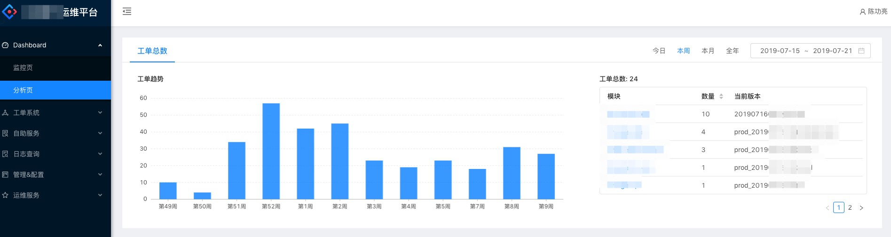
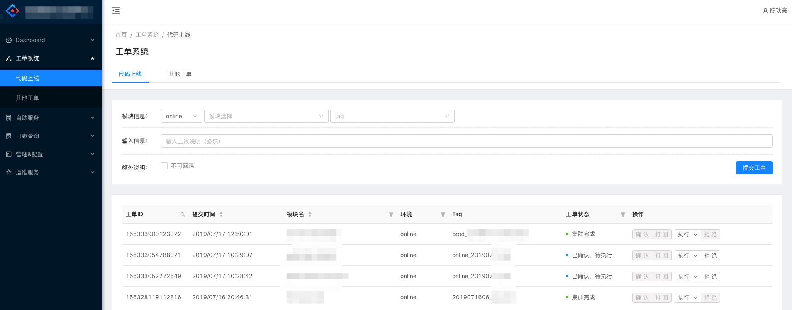
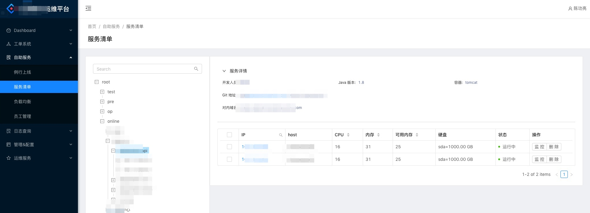
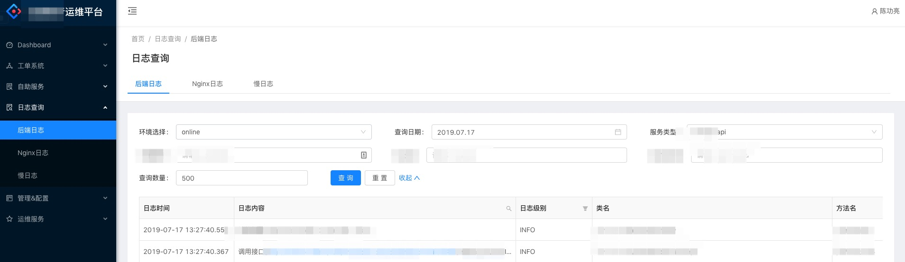
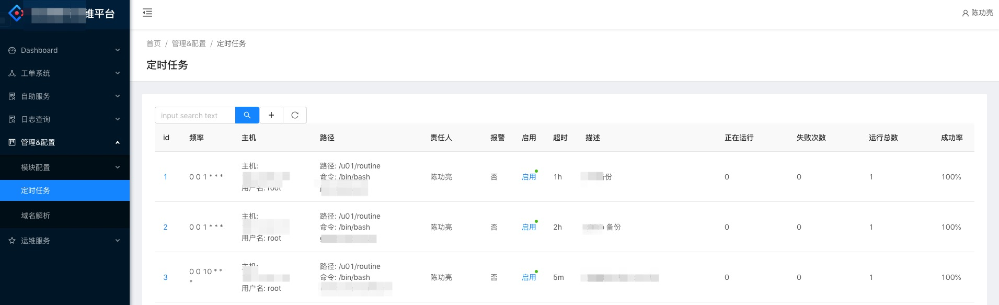
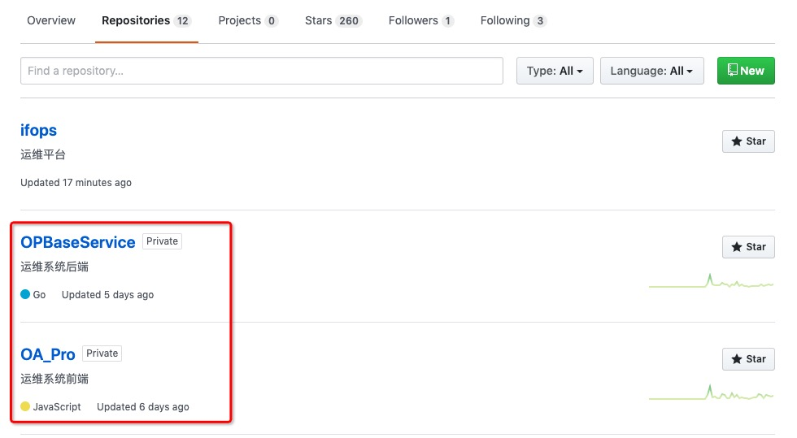

### IFOps
> 项目为本人独立开发，已在公司稳定使用，功能还在不断完善。
>
> 由于项目定制化较强，暂不开放源码，后续重新调整再放出。

#### 后端: `Golang Gin` 前端：`Ant Design Pro`

#### 目前功能:
1. 员工管理 (Ldap)，密码修改
2. 工单模块：提交、审批（通过微信或钉钉通知）
3. 代码上线（灰度、集群、回滚）
4. 资产统计
5. 域名解析（调用阿里云 API）
6. 日志查询（后端、NginX、MySQL 慢日志）
7. 定时任务（增删、执行日志）
8. 负载均衡管理（upsync 模块实现动态发现）

介绍比较简单，还有很多细节部分就不在此列出了

-------

### 部分功能截图
#### 监控页面

#### 分析页面

#### 工单

#### 服务清单

#### 日志查询

#### 定时任务

